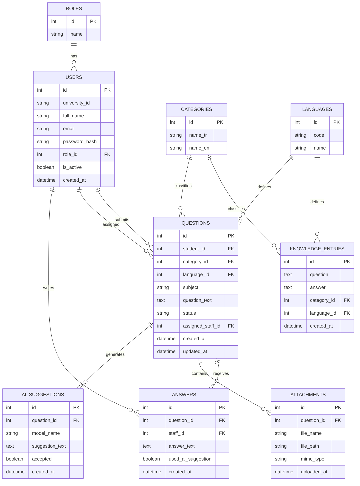

# Database Schema

This document explains the relational database structure of the DAU Student Support and Institutional Q&A System.

## Normalization Approach

The original CSV file repeats language and category information in every question-answer record.

To reduce repeated data:

- Languages are stored in the `languages` table.
- Categories are stored in the `categories` table.
- Cleaned question-answer records are stored in the `knowledge_entries` table.
- Primary keys and foreign keys connect the tables.

This structure reduces data repetition and improves data consistency.

## Entity Relationship Diagram

## Table Descriptions

### languages

This table stores the languages supported by the system.

Initial values:

- `tr`: Turkish
- `en`: English

### categories

This table stores the Turkish and English names of each question category.

Category information is stored separately to prevent the same category names from being repeated in hundreds of records.

### knowledge_entries

This table stores the 769 cleaned institutional question-answer records.

It is connected to the `categories` and `languages` tables through foreign keys.

This table will be used for knowledge-base searching and future AI-supported answer suggestions.

### roles

This table stores the system roles:

- `student`
- `staff`
- `admin`

### users

This table stores student, staff, and administrator accounts.

Passwords are not stored as plain text. Only password hashes are stored.

### questions

This table stores new questions submitted by students.

Supported question statuses:

- `open`
- `assigned`
- `answered`
- `closed`

A question is connected to a student, category, language, and optionally an assigned staff member.

### answers

This table stores the answers written by staff members.

It also records whether an AI-generated suggestion was used while preparing the answer.

### attachments

This table stores information about files attached to student questions.

The database stores file information and location instead of storing the full file directly.

### ai_suggestions

This table is prepared for future AI-generated answer suggestions.

It stores:

- Related question
- AI model name
- Suggested answer
- Whether the suggestion was accepted
- Creation date

The train/test split and AI model integration will be completed in a later project phase.

## Main Relationships

| Parent Table | Child Table | Relationship |
|---|---|---|
| roles | users | One role can have many users |
| users | questions | One student can submit many questions |
| users | questions | One staff member can receive many questions |
| users | answers | One staff member can write many answers |
| categories | knowledge_entries | One category can classify many knowledge entries |
| languages | knowledge_entries | One language can be used by many knowledge entries |
| categories | questions | One category can classify many student questions |
| languages | questions | One language can be used by many student questions |
| questions | answers | One question can have answers |
| questions | attachments | One question can have attachments |
| questions | ai_suggestions | One question can have AI suggestions |

## Database Validation

The database was validated after the data import.

Validation results:

- No foreign key errors
- 2 language records
- 31 category records
- 769 knowledge-base records
- 654 Turkish records
- 115 English records

## Database Choice

SQLite was selected for the first phase because:

- The dataset size is manageable.
- It does not require a separate database server.
- It supports relational tables and foreign keys.
- It is suitable for initial development and testing.

The system can be moved to PostgreSQL in a later phase if required.