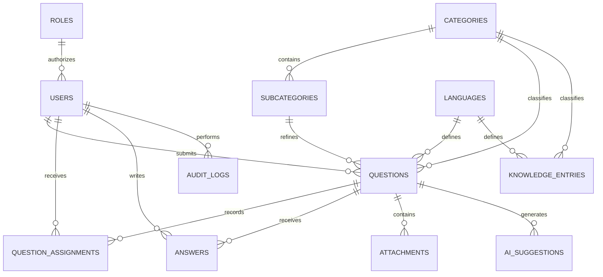

# Database Schema — Version 2

This document describes the SQLite schema used by the EMU Student Support and Institutional Q&A System. The active database reports `PRAGMA user_version = 2`.

## Design Summary

The schema separates authentication, classification, institutional knowledge, live student support, files, AI metadata, and audit history. Repeated languages and categories are normalized into referenced tables. Foreign keys protect relationships, indexes support common queries, and triggers prevent a question from using a subcategory from another category.

Existing application-friendly column names map directly to the technical specification. For example, `users.full_name` represents Name, `users.university_id` represents StudentNumber, `answers.staff_id` represents AnsweredByUserId, and `attachments.file_path` represents StoredName/Path.

## Relationship Overview



## Tables and Fields

### `roles`

| Field | Purpose |
|---|---|
| `id` | Primary key |
| `name` | Unique role: `student`, `staff`, or `admin` |

### `users`

| Field | Purpose |
|---|---|
| `id` | Primary key |
| `university_id` | Unique student/person number; optional for non-students |
| `full_name` | Display name |
| `email` | Unique login address |
| `password_hash` | bcrypt password hash |
| `role_id` | Foreign key to `roles.id` |
| `is_active` | Active-account flag |
| `created_at` | Creation timestamp |

### `languages`

| Field | Purpose |
|---|---|
| `id` | Primary key |
| `code` | Unique code (`tr`, `en`) |
| `name` | Display name |

### `categories`

| Field | Purpose |
|---|---|
| `id` | Primary key |
| `name_tr`, `name_en` | Unique bilingual names |
| `description` | Optional explanation |
| `responsible_unit` | Optional responsible department/unit |
| `is_active` | Availability flag |

### `subcategories`

| Field | Purpose |
|---|---|
| `id` | Primary key |
| `category_id` | Foreign key to parent category |
| `name_tr`, `name_en` | Bilingual names, unique within the parent |
| `is_active` | Availability flag |
| `created_at` | Creation timestamp |

### `knowledge_entries`

| Field | Purpose |
|---|---|
| `id` | Stable primary key from 1 to 744 |
| `question`, `answer` | Privacy-clean institutional Q&A text |
| `category_id` | Foreign key to `categories.id` |
| `language_id` | Foreign key to `languages.id` |
| `created_at` | Import timestamp |

### `questions`

| Field | Purpose |
|---|---|
| `id` | Primary key |
| `student_id` | Foreign key to submitting user |
| `category_id` | Required category foreign key |
| `subcategory_id` | Optional subcategory foreign key |
| `language_id` | Required language foreign key |
| `subject`, `question_text` | Student question content |
| `status` | `open`, `assigned`, `answered`, or `closed` |
| `assigned_staff_id` | Current staff assignee for fast access |
| `created_at`, `updated_at` | Lifecycle timestamps |
| `answered_at` | Time the question was answered |

`assigned_staff_id` stores the current assignment, while `question_assignments` preserves the history.

### `question_assignments`

| Field | Purpose |
|---|---|
| `id` | Primary key |
| `question_id` | Foreign key to the question |
| `assigned_to_user_id` | Foreign key to the assigned user |
| `assigned_at` | Assignment timestamp |
| `is_active` | Current/historical flag |

A partial unique index permits at most one active assignment for each question.

### `answers`

| Field | Purpose |
|---|---|
| `id` | Primary key |
| `question_id` | Foreign key to the question |
| `staff_id` | Foreign key to the answering user |
| `answer_text` | Official answer |
| `used_ai_suggestion` | Whether AI assistance was used |
| `created_at` | Answer timestamp |

### `attachments`

| Field | Purpose |
|---|---|
| `id` | Primary key |
| `question_id` | Foreign key to the question |
| `file_name` | Original safe display name |
| `file_path` | Generated relative storage path |
| `mime_type` | Validated content type |
| `file_size` | File size in bytes |
| `uploaded_at` | Upload timestamp |

Files remain outside SQLite; only validated metadata and the storage path are recorded.

### `ai_suggestions`

| Field | Purpose |
|---|---|
| `id` | Primary key |
| `question_id` | Foreign key to the question |
| `provider`, `model_name` | AI provider/model metadata |
| `prompt_context` | Prompt or retrieval context |
| `suggestion_text` | Generated response |
| `accepted`, `was_used` | Review/use flags |
| `created_at`, `generated_at` | Lifecycle timestamps |

The application stores each generated GPT-OSS suggestion with its retrieved
institutional context. The review flags show whether staff accepted and used
the suggestion in the final answer.

### `audit_logs`

| Field | Purpose |
|---|---|
| `id` | Primary key |
| `user_id` | Optional foreign key to the acting user |
| `action` | Machine-readable action name |
| `entity_type`, `entity_id` | Affected entity reference |
| `timestamp` | Event timestamp |

Login success/failure, logout, question creation and assignment, answers, attachments, category/subcategory creation, user creation, role updates, and question-category changes are logged.

## Integrity Rules

- Required relationships use foreign keys.
- `is_active`, `accepted`, and `was_used` values are constrained to Boolean integers.
- Question status is constrained to the four supported values.
- Attachment sizes cannot be negative.
- Category names are globally unique; subcategory names are unique within a category.
- Insert/update triggers reject a subcategory whose `category_id` does not match the question category.
- A unique partial index rejects multiple active assignments for one question.

## Main Indexes

Indexes cover knowledge category/language, active subcategories, question student/status/category/subcategory/assignee, answers, attachments, AI suggestions, assignment history, and audit lookups. They are declared with `IF NOT EXISTS`, so migration is idempotent.

## Version-2 Migration

Run on an existing database:

```bat
python scripts\migrate_database.py
python scripts\validate_database.py
```

The migration:

1. Creates a timestamped SQLite backup unless disabled explicitly.
2. Adds missing tables, columns, indexes, and triggers.
3. Backfills `answered_at`, assignment history, AI timestamps/use state, and attachment sizes.
4. Sets schema version 2.
5. Runs integrity and foreign-key checks.

It can be rerun without duplicating assignments or schema objects.

## Validated Database State

| Check | Result |
|---|---:|
| Schema version | 2 |
| Integrity check | `ok` |
| Foreign-key violations | 0 |
| Knowledge entries | 744 |
| Turkish entries | 603 |
| English entries | 141 |
| Dataset categories | 31 |
| Automated tests | 31 passed |

SQLite is appropriate for this project phase. A later production deployment can preserve the same relational design while moving to PostgreSQL.
